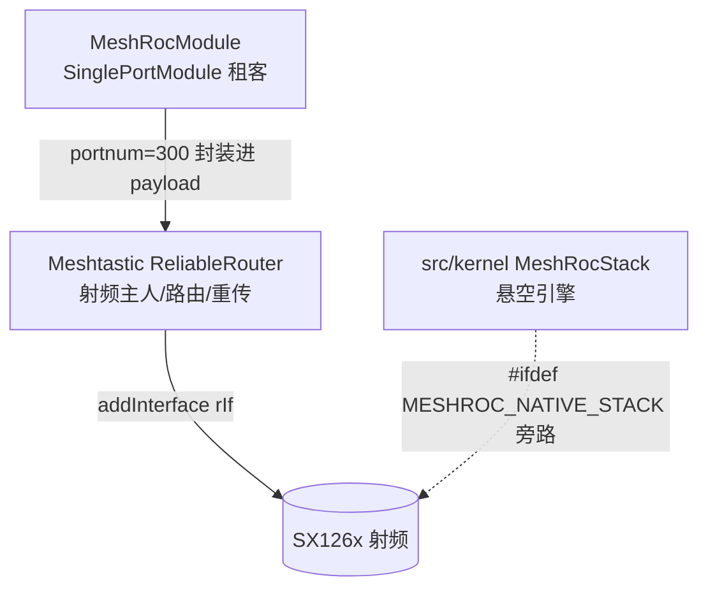
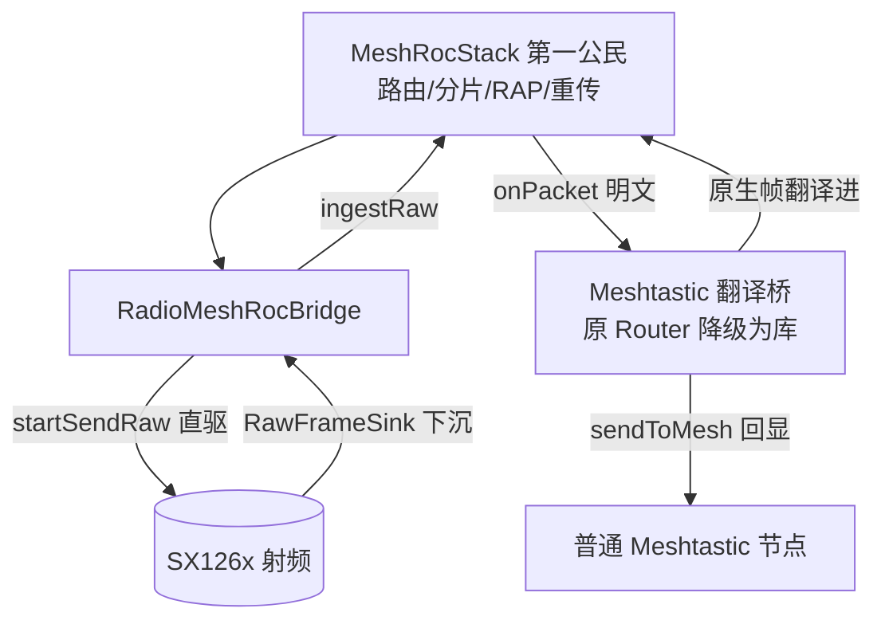

# MeshROC 架构反转方案（A 选项 / 倒反天罡 / 兼容桥）

> 状态：**方案文档（尚未落地代码）**。本仓库当前仍处于「自研栈寄生在 Meshtastic」的 C 路线形态，本文档描述从 C 演进到 A 的改造蓝图与可执行的代码改造清单。
> 关联文档：`docs/TRIPLE_STACK_COMPAT.md`（C 路线记录，本文档是其后续演进）。

---

## 0. 术语与定位纠正（先读这段）

在动手前，必须澄清一个常见的理解偏差：**当前仓库里「自研栈为第一公民」尚未成为默认形态**。实际存在两条并行路径：

| 路径 | 实现 | 门控 | 当前默认 |
|---|---|---|---|
| **路径 A（裸字节栈 / 新引擎）** | `MeshRocStack` → `RadioMeshRocBridge` → `RadioLibInterface::startSendRaw` / `rawSink_` | `#ifdef MESHROC_NATIVE_STACK` | **关闭** |
| **路径 B（封装层 / 旧兼容）** | `MeshRocModule` 把 datapack 帧作为 blob 塞进 `MeshPacket.decoded.payload`（portnum=300），复用 Meshtastic 原生路由/加密/重传 | 无条件 | **常开** |

`MeshRocModule.h:12-19` 头注释明确声明：*不改动原生 Meshtastic 的 MeshPacket/protobuf/加密传输层*。所以「自研栈为主、Meshtastic 为翻译桥」是**目标态**，不是现状。

本文档描述的 A 选项终态：**路径 A 升格为射频主用方（第一公民），路径 B 退化为协议翻译官（桥接普通 Meshtastic 节点）**。

---

## 1. 现状 vs 终态三维度对照

| 维度 | 现状（C 路线 / 寄生） | 终态（A 路线 / 倒反天罡） |
|---|---|---|
| **射频主权** | 原版 `ReliableRouter` 经 `router->addInterface(std::move(rIf))`（main.cpp:1225）独占 SX126x | `RadioMeshRocBridge` 经 `startSendRaw()`（RadioLibInterface.cpp:816）直驱 SX126x，成为唯一射频主 |
| **路由/分片/重传归属** | 原版 `Router` 全权负责 | 自研 `MeshRocStack`（路由+O1~O5/RAP+分片+重传）负责；原版射频层仅作「收帧翻译」 |
| **Meshtastic 角色** | 宿主框架 + 射频主人 + 路由；`MeshRocModule` 是它身上的租客 | 降级为「翻译官」：解析普通节点的原生帧，翻译成 `MeshRocStack` 投递；反向把自研栈明文回显给普通节点 |

---

## 2. 拓扑图

### 2.1 现状（寄生）

### 2.2 终态（A 倒反天罡）

---

## 3. 编译开关策略（关键：宏名纠正）

> **核实结论**：全 `src` grep `MESHTASTIC_AS_BRIDGE` 为 **0 结果**，该宏**不存在**。现有唯一门控是 `MESHROC_NATIVE_STACK`。

### 3.1 现状开关

`MESHROC_NATIVE_STACK` 在 main.cpp 中分 **4 段分散 `#ifdef`**（非单一连续块）：

| 段 | 行号 | 内容 |
|---|---|---|
| 头 include + extern | 56–60 | `#include` + `extern meshroc::RadioMeshRocBridge *g_meshrocBridge;` |
| setup 接入 | 1267–1284 | 实例化 `static` 桥对象、`registerWithRadio()`（1278）、`g_meshrocBridge = &bridge;`（1280） |
| 全局定义 | 1290–1291 | `meshroc::RadioMeshRocBridge *g_meshrocBridge = nullptr;` |
| loop tick | 1390–1395 | `g_meshrocBridge->tick(millis());`（1393） |

### 3.2 升格策略（A 落地时）

1. **`MESHROC_NATIVE_STACK` 从「旁路」升格为「默认主路径」**：在 `platformio.ini` 的 `build_flags` 中**默认定义**该宏（去掉「默认关闭」）。这样 `RadioMeshRocBridge` 自动成为射频主用方，无需手动开编译开关。
2. **新增 `MESHTASTIC_AS_BRIDGE` 宏**（本文档新定义，原仓库无）：控制原版 `ReliableRouter` 是否仅作翻译库运行（不 `addInterface` 主射频）。
   - 定义 `MESHTASTIC_AS_BRIDGE` → 原版栈降级为翻译桥（目标终态）。
   - 不定义 → 保留原版栈全功能（兼容调试 / 回滚用）。

> 注意：文档前文计划提到的「`MESHTASTIC_AS_BRIDGE` 已作为新增宏」是指**本文档提议新增**，并非已有代码。落地时需在合适头文件（如 `meshroc_build_options.h` 或 `main.cpp` 顶部）定义它，并补充对应的 `#ifdef` 分支。

---

## 4. 改造文件清单与逐项动作

### 4.1 `src/main.cpp`

| 行号 | 现状 | A 改造动作 |
|---|---|---|
| 875 | `router = new ReliableRouter();` | 保留构造，但**不再独占射频**。当定义 `MESHTASTIC_AS_BRIDGE` 时，该 router 仅作翻译库实例存在 |
| 1169 | `auto rIf = initLoRa();` | 保留 `rIf`，但**不再** `move` 给 `ReliableRouter` |
| 1225 | `router->addInterface(std::move(rIf));` | 用 `#ifndef MESHTASTIC_AS_BRIDGE` 包裹：定义翻译桥时不挂主射频给原版 router；`rIf` 改为交给 `RadioMeshRocBridge` 作「收帧翻译」用 |
| 1267–1284 | `MESHROC_NATIVE_STACK` 块（实例化桥 + registerWithRadio + 赋值 g_meshrocBridge） | 升格为默认执行（宏默认定义）；确保 `registerWithRadio()`（1278）在 `rIf` 就绪后调用 |
| 1290–1291 | `g_meshrocBridge` 全局定义 | 保留 |
| 1390–1395 | `g_meshrocBridge->tick(millis());` 在 loop | 升格为默认执行，驱动自研栈周期任务 |

**接线要点**：
- `g_meshrocBridge` 的 extern 声明在 **main.cpp:59**，定义在 **main.cpp:1291**（**不在** `MeshROCBridge.h`，文档勿写错）。
- 射频接口变量名为 `rIf`（`initLoRa()` 返回，1169/1225）。
- `router` 类型为 `Router*`（286 声明，875 `new ReliableRouter()`）。

### 4.2 `src/modules/Modules.cpp`

| 行号 | 现状 | A 改造动作 |
|---|---|---|
| 104 | `#include "modules/MeshRocModule.h"` | 保留 |
| 212 | `meshRocModule = new MeshRocModule();`（setupModules 内，始终启用块） | 改造后 `MeshRocModule` 构造函数需接收 `meshroc::MeshRocStack&` 引用（依赖注入），不再 `SinglePortModule` 派生 |

全局符号：`MeshRocModule *meshRocModule;`（定义在 MeshRocModule.cpp:13，extern 在 MeshRocModule.h:456）。`sendTextSmart`（定义 MeshRocModule.cpp:407 / 声明 .h:282）仍被其它模块调用，改造后需保留对外接口签名稳定。

### 4.3 `src/modules/MeshRocModule.{h,cpp}`（改造为核心：翻译官）

**现状（租客）**：
- 基类：`class MeshRocModule : public SinglePortModule, private concurrency::OSThread`（.h:257）
- 构造：`SinglePortModule("meshroc", MR_PORTNUM)`（.cpp:156），`MR_PORTNUM = (meshtastic_PortNum)300`（.h:38）
- 收包：`handleReceived`（.cpp:202，同时监听端口 300 与 1）
- 发包核心 `sendFrame`（.cpp:610）：`MeshRocCodec::serialize(...)`（613）→ `allocDataPacket()`（619）→ `memcpy(p->decoded.payload.bytes, blob, n)`（623-624）→ `service->sendToMesh(p)`
- 注意：`sendFrame` **未手动设** `decoded.portnum`，portnum=300 来自基类构造注册（.cpp:156）。

**A 改造后边界**：
1. 移除 `SinglePortModule` 基类，改为「运行在 `MeshRocStack` 之上的适配器」——构造函数依赖注入 `meshroc::MeshRocStack&`。
2. 暴露两个适配方法（文档建议签名，非臆造 API，落地时按需微调）：
   - `translateFromMeshtastic(const meshtastic_MeshPacket& mp)`：把原生 Meshtastic 文本帧（portnum=1）翻译成 `MeshRocStack::sendPayload()`（声明 MeshRocStack.h:54，定义 .cpp:58）投递进自研网络。
   - `translateToMeshtastic(...)`：把自研栈 `onPacket` 收到的明文翻译回 `service->sendToMesh()` 让普通节点显示。
3. 移除 `allocDataPacket`/`sendToMesh` 的**直接调用**（原 .cpp:379/619/804/845/887 等处），改为经自研栈投递；保留 `service->sendToMesh()` 仅用于「回显给普通节点」。
4. 保留 `sendTextSmart`（.cpp:407）对外接口，内部改为调 `translateFromMeshtastic` 路径。

### 4.4 `src/mesh/MeshROCBridge.{h,cpp}`（射频接驳桥，已基本就绪）

| 符号 | 位置 | 说明 |
|---|---|---|
| `RadioMeshRocBridge : public MeshRocStack` | .h:27 | 已就绪的桥，继承自研栈 |
| `registerWithRadio()` | .cpp:20 | 调 `radio_->setRawFrameSink(&rawSinkAdapter, this)`（23） |
| `sendRaw` | .cpp:27 | 调 `radio_->startSendRaw(bytes, len)`（39） |
| `channelUtilization` | .cpp:42 | 委托 `radio_->currentChannelUtilization()` |
| `slotTimeMsec` | .cpp:47 | 委托 `radio_->currentSlotTimeMsec()` |
| `onPacket` | .cpp:52 | 默认仅 LOG_INFO，终态应转发给翻译官 |
| `rawSinkAdapter`（静态） | .cpp:60 | 调 `self->ingestRaw(buf, len, 0)`（67） |

**A 改造动作**：`onPacket`（.cpp:52）从「仅 LOG_INFO」改为把明文投递给 `MeshRocModule` 翻译官（`translateToMeshtastic`）。`RadioMeshRocBridge` 需持有 `MeshRocModule&` 或回调。

### 4.5 `src/mesh/RadioLibInterface`（.h/.cpp）（射频层，已就绪，勿重写）

| 符号 | 位置 | 说明 |
|---|---|---|
| `startSendRaw` | .h:200 / .cpp:816 | 直驱 SX126x 发射，绕过 MeshPacket |
| `RawFrameSink` 类型 | .h:211 | `using RawFrameSink = void(*)(const uint8_t* buf, size_t len, int16_t rssi, int8_t snr, void* ctx);` |
| `setRawFrameSink()` | .h:215 | inline，设 `rawSink_` / `rawSinkCtx_` |
| `rawSink_` / `rawSinkCtx_` | .h:103-104 | 成员 |
| `handleReceiveInterrupt` | .cpp:605 / .h:311 | 读数据成功后先调 sink |
| 调用 rawSink 的位置 | .cpp:649-653 | **在 meshtastic 解析之前**（注释明确「BEFORE meshtastic parsing」） |
| `currentChannelUtilization()` | .h:204 / .cpp:852 | 读 `airTime->channelUtilizationPercent()` |
| `currentSlotTimeMsec()` | .h:207 / .cpp:859 | 返回 `slotTimeMsec` 成员 |

**A 改造动作**：射频层**无需重写**。原版解析路径（sink 之后）在 `MESHTASTIC_AS_BRIDGE` 下仍保留以支撑翻译官收帧；非 MeshROC 帧静默走原版解析，不影响翻译路径。

### 4.6 `src/kernel/MeshRocStack.{h,cpp}`（自研引擎，零依赖，勿动架构）

| 符号 | 位置 | 说明 |
|---|---|---|
| `sendPayload` | .h:54-56 / .cpp:58 | `bool sendPayload(uint16_t dst, const uint8_t* payload, uint16_t len, MeshRocPriority prio=LOW, bool wantAck=false)` |
| `ingestRaw` | .h:60 / .cpp:272 | CRC16 校验 + 分发 RAP/data |
| `tick` | .h:65 / .cpp:424 | 驱动 O1/O归属/O5/O4 |
| `onPacket` | .h:68（虚，默认空） | 派生类 `MeshROCBridge.cpp:52` 重载 |
| `sendRaw`（protected 虚） | .h:78 | 字节出口，派生类重载（MeshROCBridge.cpp:27） |
| `channelUtilization` / `slotTimeMsec` 虚钩子 | .h:81 / .h:84 | 基类默认 0 / DEFAULT_SLOT_TIME_MSEC |

**零依赖铁律（已核实）**：`.h:1-16` 仅 include `cstdint/cstddef` + `config/MeshROCConfig.h` + `net/*.h` + `rf/*.h`，**无任何** `Router` / `RadioInterface` / `ReliableRouter` / meshtastic 射频头。`.cpp:1-3` 仅 include 自身 + `<cstring>` + `<algorithm>`。A 改造**严禁**在 `kernel/` 内引入原版射频/Router 头，保持零依赖解耦。

---

## 5. 分阶段实施步骤（C→A 演进）

> 原则：**先跑通自研栈（Phase 1），再补翻译官（Phase 2），最后功能回归（Phase 3）**。每阶段可独立编译验证、可独立回滚。

### Phase 0 — 文档与开关骨架（本任务）
- 产出本文档 `docs/MESHROC_INVERSION.md`。
- 在 `platformio.ini` 与合适头文件预留 `MESHTASTIC_AS_BRIDGE` 定义位（先不默认开）。

### Phase 1 — 开关升格与 main.cpp 接线（自研栈为主）
1. `platformio.ini` 默认定义 `MESHROC_NATIVE_STACK`（升格为默认主路径）。
2. main.cpp:1225 `router->addInterface(...)` 用 `#ifndef MESHTASTIC_AS_BRIDGE` 包裹；定义翻译桥时 `rIf` 改交 `RadioMeshRocBridge`。
3. 确认 main.cpp:1267-1284 桥实例化与 `registerWithRadio()`（1278）在 `rIf` 就绪后执行（宏默认开后自动生效）。
4. 验证：自研栈 `tick` 驱动、射频经 `startSendRaw` 直发，原版栈不占主射频。

### Phase 2 — MeshRocModule 改造为翻译官
1. 移除 `SinglePortModule` 基类，构造注入 `MeshRocStack&`。
2. 实现 `translateFromMeshtastic` / `translateToMeshtastic`。
3. `RadioMeshRocBridge::onPacket`（.cpp:52）转发明文给翻译官。
4. 保留 `sendTextSmart`（.cpp:407）对外签名稳定。
5. 验证：普通 Meshtastic 节点发的文本被翻译成 MeshROC 帧经自研网络送出，反向回显正常。

### Phase 3 — 功能回归与清理
1. 重新接驳原版依赖射频的功能（OTA / NodeDB / 位置共享 / MQTT），确认在 A 架构下仍可用或明确标注不支持。
2. 更新 `docs/TRIPLE_STACK_COMPAT.md` 标注 C→A 演进关系。
3. 删除/停用路径 B 中 redundant 的 `allocDataPacket` 直发路径（保留 `sendToMesh` 回显）。

---

## 6. 风险点与回滚方案

### 风险
1. **原版功能断点**：OTA / NodeDB / 位置共享 / MQTT 当前依赖原版 `Router` 射频路径。A 改造后原版不占主射频，这些功能需重新接驳，否则静默失效。
2. **`ReliableRouter` 不 `addInterface` 后的内部状态**：原版某些模块（如 `MeshService` 文本接管）直接调 `sendToMesh`，若 router 无射频接口可能断言/空发。需排查 `MeshService` 等依赖。
3. **翻译官收帧竞态**：`RadioLibInterface::handleReceiveInterrupt`（.cpp:605）先调 `rawSink_`（649-653，BEFORE meshtastic parsing）再走原版解析。同一帧既被自研栈 `ingestRaw` 又被原版解析，需确保不过度处理（如重复显示）。
4. **`g_meshrocBridge` 生命周期**：当前是 setup 内 `static` 局部（main.cpp:1272-1280），升格默认开后需确认其生命周期覆盖 loop 全程。
5. **本机无法 `pio run`**：github.com 直连超时、依赖拉取失败，编译验证须用户环境进行（见 §7 验收标准，非「已验证」）。

### 回滚
- **开关级回滚**：不定义 `MESHTASTIC_AS_BRIDGE` + 在 `platformio.ini` 移除 `MESHROC_NATIVE_STACK` → 退回 C 路线现状（原版栈全功能、自研栈旁路）。
- **代码级回滚**：Phase 2/3 的 `MeshRocModule` 改造用 git 分支隔离；若翻译官不稳定，保留 `MESHROC_NATIVE_STACK` 但临时禁用 `MeshRocModule` 翻译路径，仍可让自研栈独立运行。

---

## 7. 验收标准（非「已验证」）

- [ ] `MESHROC_NATIVE_STACK` 默认开后，自研栈 `RadioMeshRocBridge` 经 `startSendRaw` 直驱 SX126x 成功收发 MeshROC 帧（两台自研固件互通）。
- [ ] 定义 `MESHTASTIC_AS_BRIDGE` 后，原版 `ReliableRouter` 不 `addInterface` 主射频（main.cpp:1225 被跳过）。
- [ ] 普通 Meshtastic 节点发的文本消息，经 `MeshRocModule` 翻译官进入自研网络，并被另一台自研固件节点接收。
- [ ] 自研栈 `onPacket` 收到的明文，经翻译官 `sendToMesh` 回显到普通 Meshtastic 节点屏幕。
- [ ] `kernel/` 内无新增原版射频/Router 头 include（零依赖铁律保持）。
- [ ] 文档 `docs/TRIPLE_STACK_COMPAT.md` 已补充 C→A 演进说明。
- [ ] 编译在用户环境通过（`pio run`），本机未做编译验证。

---

## 8. 附录：与 TRIPLE_STACK_COMPAT.md 的演进关系

`docs/TRIPLE_STACK_COMPAT.md` 记录的是 **C 路线**：双栈并存、射频只此一份、自研栈经 `RadioMeshRocBridge` 绕过 `MeshPacket` 管线做旁路监听。那是「自研栈寄生」到「自研栈独立」的过渡记录。

本文档（A 选项）是其**后续演进**：把 C 路线里「旁路监听」的自研栈翻转为「射频主用方」，并把原版 Meshtastic 从「宿主」降为「翻译桥」。两者不冲突——A 是在 C 已搭好的 `RadioMeshRocBridge` / `RawFrameSink` / `startSendRaw` 骨架之上做主权翻转，而非重写射频层。
